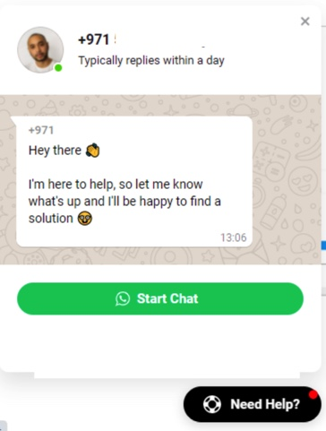

# 🤖 WhatsApp AI Sales Agent


[](https://openai.com)
[](https://railway.app/new/template?template=https://github.com/bibinprathap/whatsapp-chatbot)

> **The First Open-Source AI Sales Agent for WhatsApp.** Convert natural language messages to SQLite orders instantly using LLM-powered intent recognition.

## ✨ NEW: Natural Language Ordering (NL-to-Cart)

**Say goodbye to rigid menu navigation!** Customers can now type orders naturally:

```
"I want 2 milks and an apple delivered to Downtown Dubai"
```

The AI instantly parses this into a structured cart and responds with a confirmation — **skipping the menu stages entirely**.

| Traditional Flow | AI-Powered Flow |
|-----------------|-----------------|
| Send "1" → View Menu → Send "1" → Add item → Send "#" → Enter address → Confirm | Just type your order naturally → Done ✅ |

### 🎯 How It Works

```
User: "Send me 2 apples and some sugar to Marina Walk"
           ↓
    [LLM Intent Classifier]
           ↓
    { items: [{id: 2, qty: 2}, {id: 3, qty: 1}], address: "Marina Walk" }
           ↓
    [Direct Cart Injection]
           ↓
Bot: "🛒 ORDER CONFIRMED VIA AI 🤖
      📦 Items: 2x Apple, 1x Sugar
      💰 Subtotal: 18 reais
      📍 Address: Marina Walk
      ✅ Order placed successfully!"
```


## Why this repository matters

The WhatsApp automation niche is crowded with sticker bots and one-off experiments. This project targets the revenue-focused segment: **WhatsApp Commerce** with **AI-native ordering**. 

### 🚀 Key Differentiators

- **LLM-Powered NL-to-Cart**: OpenAI function calling converts natural language to structured orders
- **Hybrid Architecture**: AI handles complex orders; traditional flows remain for simple navigation
- **Privacy-First Options**: Swap OpenAI for Ollama (local LLM) with minimal code changes
- **Zero Menu Friction**: Customers order in their own words, not your menu's structure

## Feature snapshot

- 🤖 **AI Natural Language Ordering** — Type "2 milks and an apple" → instant cart creation
- 📱 Multi-device WhatsApp connection via `@whiskeysockets/baileys` (no Chrome dependency)
- 💾 Persistent carts, addresses, and timestamps stored with `better-sqlite3`
- 🔄 Stage router (`src/stages/*.js`) for deterministic menu flows and recovery journeys
- ⏰ Cron-driven abandoned cart nudges every 10 minutes (`src/cron_jobs.js`)
- 📚 Ready-to-fork documentation bundle (CODE_EXPLANATION, QUICK_REFERENCE, TROUBLESHOOTING)
- 🔑 Token-based auth state stored under `./tokens/session-name` for fast reconnects

## Competitive value matrix

| Capability | whatsapp-chatbot | WhatsApp Business API | Generic chatbot SaaS |
|------------|------------------|-----------------------|----------------------|
| Cost | Free / self-hosted | Per-conversation billing | Subscription or per-seat |
| Setup time | Under 10 minutes (QR scan) | Weeks (verification + approval) | 1-3 days (vendor onboarding) |
| Custom logic | Full Node.js access, cron hooks, SQLite | Template-based | Limited UI flows |
| Data ownership | Stay on your VPS / local machine | Meta hosted | Vendor hosted |
| Deployment targets | Local dev, Docker, Railway, VPS | Meta approved vendors only | Provider only |

## Documentation at a glance

| Read first | Why |
|-----------|-----|
| [`CODE_EXPLANATION.md`](./CODE_EXPLANATION.md) | Full architecture tour, stage-by-stage walkthrough |
| [`QUICK_REFERENCE.md`](./QUICK_REFERENCE.md) | Copy-paste snippets, DB queries, deployment cheatsheet |
| [`TROUBLESHOOTING.md`](./TROUBLESHOOTING.md) | Venom vs Baileys issues, alternative stacks |
| [`INTEGRATION_GUIDE.md`](./INTEGRATION_GUIDE.md) | Phase summaries, schema, refactor notes |

## Demo flow

| Welcome | Menu | Order | Address | Bill |
|---------|------|-------|---------|------|
|  |  |  |  |  |

## Quick start (local)

Requirements: Node.js 18+, npm, Git, SQLite (bundled with `better-sqlite3`).

```bash
git clone https://github.com/bibinprathap/whatsapp-chatbot.git
cd whatsapp-chatbot
npm install

# Enable AI ordering (optional but recommended)
cp .env.example .env
# Edit .env and add your OpenAI API key

npm run dev
```

1. Scan the QR printed in the terminal with WhatsApp on your phone.
2. Chat from the paired device; the bot replies instantly.
3. **Try AI ordering**: Send "I want 2 apples and a milk" — watch the magic! 🪄
4. `botwhatsapp.db` stores user sessions, carts, and timestamps in the repo root.

### 🔑 Environment Variables

| Variable | Required | Default | Description |
|----------|----------|---------|-------------|
| `OPENAI_API_KEY` | For AI features | - | Your OpenAI API key |
| `OPENAI_MODEL` | No | `gpt-4o-mini` | Model to use (cost vs quality) |

> **💡 No API key?** The bot works perfectly with traditional menu navigation. AI features gracefully degrade.

## Deploy to Railway (2-minute cloud demo)

1. Click the **Deploy on Railway** button above.
2. Create a Railway account (free tier works for tests).
3. When prompted, set environment variables if you override defaults (e.g., `SESSION_NAME`, custom cron interval).
4. Deploy, open the logs tab, and scan the QR rendered there.

Railway auto-builds Node.js apps. Be mindful of idle timeouts on free tiers; persistent production workloads should move to a VPS or container platform.

## Configuration & project internals

| File | Responsibility |
|------|----------------|
| `src/server.js` | Bootstraps Baileys, prints QR, manages reconnection strategy, **intercepts messages for AI processing** |
| `src/nlp/index.js` | 🆕 Natural Language processor entry point |
| `src/nlp/openai.js` | 🆕 OpenAI function calling integration |
| `src/nlp/parser.js` | 🆕 Cart builder and order summary generator |
| `src/storage.js` | `getState` / `setState` helpers to abstract SQLite access |
| `src/stages.js` + `src/stages/*` | Stage registry; each stage exports `exec` to mutate state and send replies |
| `src/cron_jobs.js` | `node-cron` schedule that finds carts stuck in stages 2-3 and sends recovery nudges |
| `src/menu.js` | Customizable catalog mapped to numeric choices |
| `botwhatsapp.db` | Auto-created SQLite database using WAL mode for concurrent reads |

## 🧠 AI Architecture

```
┌─────────────────────────────────────────────────────────────────┐
│                     MESSAGE FLOW                                 │
├─────────────────────────────────────────────────────────────────┤
│                                                                  │
│  User Message                                                    │
│       │                                                          │
│       ▼                                                          │
│  ┌─────────────┐    No    ┌──────────────────┐                  │
│  │ Pre-filter  │ ────────▶│ Stage Router     │                  │
│  │ (Keywords)  │          │ (Traditional)    │                  │
│  └─────────────┘          └──────────────────┘                  │
│       │ Yes                                                      │
│       ▼                                                          │
│  ┌─────────────────────────────────────────┐                    │
│  │      OpenAI Function Calling            │                    │
│  │  ┌─────────────────────────────────┐   │                    │
│  │  │ Tools:                          │   │                    │
│  │  │  • create_order(items, address) │   │                    │
│  │  │  • not_an_order(reason)         │   │                    │
│  │  └─────────────────────────────────┘   │                    │
│  └─────────────────────────────────────────┘                    │
│       │                                                          │
│       ▼                                                          │
│  ┌─────────────┐          ┌──────────────────┐                  │
│  │ Build Cart  │ ────────▶│ Update SQLite    │                  │
│  │ & Summary   │          │ Skip to Stage 3/4│                  │
│  └─────────────┘          └──────────────────┘                  │
│                                                                  │
└─────────────────────────────────────────────────────────────────┘
```

Default settings:

- Auth tokens live under `./tokens/session-name`. Delete the folder to force a new login.
- Cron job interval defaults to `*/10 * * * *` (run every 10 minutes).
- Abandoned cart detection triggers after 1 hour of inactivity; tweak `ONE_HOUR_AGO` inside `src/cron_jobs.js` as needed.

## Strategic growth roadmap

1. **Hero README**: Ship this conversion-focused landing page with badges, demo assets, and clear CTAs.
2. **One-click deploy**: Railway template link provided; keep Docker instructions in backlog for VPS users.
3. **Awesome list outreach**: Target niche lists (`awesome-whatsapp`, `awesome-ecommerce-tools`) once the star count threshold is met.
4. **Ecosystem tagging**: Use repo topics such as `baileys`, `whatsapp-md`, `ecommerce-bot` to match high-intent searches.
5. **Community loop**: Spin up Discord + WhatsApp Channel for support; funnel repetitive issues away from GitHub and convert grateful users into stargazers.
6. **Gamified contributions**: Label `good first issue`, add `CONTRIBUTING.md`, and maintain a welcoming CODE_OF_CONDUCT to encourage pull requests.
7. **Content marketing**: Publish companion tutorials on Dev.to/Hashnode and short YouTube walkthroughs linking back here.
8. **Launch moments**: Plan coordinated "Show HN" and Product Hunt launches once the one-click deploy flow is ironed out.
9. **Visual branding**: Update GitHub social preview art plus promo cards for LinkedIn/Twitter; include logos for WhatsApp + Node.js.
10. **AI alignment**: Document ongoing or planned ChatGPT/OpenAI integrations (intent understanding, smart replies) to ride the LLM wave.

This roadmap turns a functioning bot into a growth engine by aligning docs, deployment, and distribution.

## Community & support

- Demo line: [wa.me/917994671704](http://wa.me/917994671704)
- Creator: [Bibin Prathap](https://linkedin.com/in/bibin-prathap-4a34a489) — reach out for consulting (+971 569245365)
- Issues: please include logs, stage number, and reproduction steps when opening GitHub issues
- Contributions: fork the repo, branch from `master`, run tests locally, and open a PR referencing the context doc you used (e.g., `CODE_EXPLANATION.md`)

## License

MIT License — see [`LICENSE`](./LICENSE). Commercial projects are welcome; attribution via a star is appreciated.

---

If this project helps you launch or learn, **please star the repository** so more founders and engineers can discover it.

# 📚 Documentation Index & Quick Navigation

> **🎯 NEW TO THIS PROJECT?** Start here: [**CODE_EXPLANATION.md**](./CODE_EXPLANATION.md)

| Document | Purpose | Best For |
|----------|---------|----------|
| **[CODE_EXPLANATION.md](./CODE_EXPLANATION.md)** ⭐ | Complete code walkthrough | Understanding how everything works |
| **[QUICK_REFERENCE.md](./QUICK_REFERENCE.md)** ⚡ | Cheat sheet & quick tasks | Quick lookup while coding |
| **[TROUBLESHOOTING.md](./TROUBLESHOOTING.md)** 🔧 | Connection issues & fixes | When something breaks |
| **[INTEGRATION_GUIDE.md](./INTEGRATION_GUIDE.md)** ✅ | Phase 1, 2, 3 summary | Understanding changes made |

---
### Video Walkthrough  
A brief video demonstrating the core functionality of Whatsapp chatboat  

[](https://drive.google.com/file/d/1p-RHNgDTuiv_sD1AgShHBQpSK5udwJWo/view?usp=sharing)  
 

# Whatsapp Bot  
#  Demo [wa.me/917994671704](http://wa.me/917994671704) 
#  contact me for support +971569245365

# https://bibinprathap.com/
# Thanks for Checking Out This Project! 🚀

If you find this project helpful or interesting, I’d really appreciate it if you could ⭐ **star the repository** — it helps others discover the work and supports the project's growth.

## Project description
WhatsApp Chatbot 🤖
A Node.js WhatsApp chatbot using Baileys, SQLite, and cron jobs for automated order handling and customer support.

## Features
- **WhatsApp connection via Baileys**
- **QR code login in terminal**
- **Persistent user state with SQLite**
- **Multi-stage conversation flow**
- **Automated abandoned cart reminders**
- **Easy setup and deployment**

- @whiskeysockets/baileys is a powerful Node.js library for building WhatsApp bots and clients. It provides a simple, event-driven API to connect, send/receive messages, manage sessions, and automate WhatsApp interactions using the multi-device protocol.
Version 6.6.0 offers stable support for QR code authentication, message handling, media, and group management, making it ideal for chatbot and automation projects.

<p align="center"></p>
<h1 align="center">
    <a href="https://nodejs.org/en/">🔗 NodeJS</a>
    <a href="https://www.npmjs.com/package/venom-bot">🧠 Venom Bot</a>
</h1>
<p align="center"> 


<a href="https://linkedin.com/in/bibin-prathap-4a34a489/">

</a>

</p>
<p align="center">🚀 Project created in order to assist in the demands of orders from  customers  via WhatsApp.
 Start Chat
</p>
<br>
<h1 align="center">
 Start Chat  
  
  Welcome
  
  Menu
  
  Order
  
  Address
  
  Bill
   
    save this in the database
  
</h1>

### Prerequisites

Before starting, you will need to have the following tools installed on your machine:
[Git](https://git-scm.com), [Node.js](https://nodejs.org/en/).
Also, it's nice to have an editor to work with code like[VSCode](https://code.visualstudio.com/).

### 🎲 Running our application

```bash
# Clone this repository
$ git clone git@github.com:bibinprathap/whatsapp-chatbot.git

# Access the project folder in the terminal/cmd
$ cd whatsapp-chatbot

# install dependencies
$ npm install

# Run the application in development mode
$ yarn dev

## Ready, scan the QR code of Whatsapp and Voilà, enjoy!
```

### 🛠 Technologies

The following tools were used in the construction of the project:

- [Node.js](https://nodejs.org/en/)
 

## Want More? 🔥 
- [AI Agent Whatsapp](https://github.com/bibinprathap/AI-Agent-whatsapp)
   

 
# AI Agent for WhatsApp 🤖💬

An AI-powered WhatsApp agent that leverages advanced natural language processing to provide intelligent responses and automate conversations.

## Features ✨

- **Natural Language Understanding**: Processes user messages with AI comprehension
- **Automated Responses**: Provides instant replies to common queries
- **Context Awareness**: Maintains conversation context for more natural interactions
- **Multi-language Support**: Communicates in various languages
- **Easy Integration**: Simple setup with WhatsApp Business API

 
Thanks again for your support! 🙏  
Let’s keep building great things together.


### Author

---
  

Done with ❤️ by Bibin Prathap 👋🏽 !

<h3 align="left">Connect with me: +971 569245365</h3>
<p align="left">
<a href="https://linkedin.com/in/bibin-prathap-4a34a489" target="blank"></a>
<a href="https://stackoverflow.com/users/6724770/bibin-prathap" target="blank"></a>
<a href="https://fb.com/bibin.prathap" target="blank"></a>
<a href="https://medium.com/@bibinprathap" target="blank"></a>
</p> 

<h3 align="left">Support:</h3>
<p><a href="https://www.buymeacoffee.com/bibinprathap"> </a></p><br><br>
<a href="https://experttutorshub.com/" target="blank">experttutorshub.com</a>


